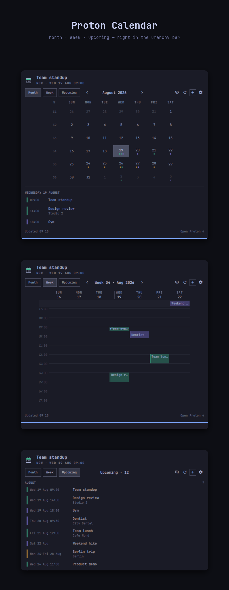

# Proton Calendar for Omarchy

Your Proton Calendar in the Omarchy bar: what's next, a month grid, a week
grid, and an upcoming list — with a quick add that hands off to the Proton web
app.



## What it does, and what it can't

Proton Calendar has no CalDAV and no public write API. Reading works well:
the plugin fetches your calendar's share link (plain iCalendar over HTTPS),
expands recurring events, and caches the result. Writing is a handover —
quick add copies the title to your clipboard and opens the Proton web app on
the right day, but you finish the event in the browser.

The share link is a secret URL — anyone holding it can read that calendar,
and its contents are no longer end-to-end encrypted the way the rest of your
Proton data is.

## Requirements

```bash
sudo pacman -S --needed python-icalendar python-recurring-ical-events wl-clipboard
```

`python-icalendar` and `python-recurring-ical-events` are required for the
plugin to work at all — without them it can't parse your calendar feed.
`wl-clipboard` is needed for the quick-add clipboard handover.

## Install

```bash
omarchy plugin add https://github.com/itsmoorgrove/omarchy-protoncalendar --enable
```

Then open the panel and paste your calendar's share link (Proton Calendar →
Settings → Calendars → your calendar → Share → Share with anyone).

## Features

- **Bar mark** — pips for how much is on today, a warning colour when a feed
  is stale, and the next event's title beside it
- **Month** — always six rows, ISO week numbers, today outlined, up to four
  event dots per day
- **Week** — an hour grid with an all-day band, overlapping events side by
  side, and a line for right now
- **Upcoming** — everything ahead as one dated list, grouped by month
- **Quick add** — day pre-filled, time defaults to the next half hour, title
  copied to the clipboard, opens Proton on the right day
- **Multiple calendars** — add and remove feeds from the panel's gear menu

## Keyboard

| Key | Action |
|---|---|
| `←`/`→` or `[`/`]` | Previous / next month or week |
| `↑`/`↓` or `{`/`}` | Previous / next year or four weeks |
| `t` / `enter` | Back to today |
| `m` / `e` / `u` | Month / week / upcoming |
| `b` | Cycle the bar label |
| `s` | Show/hide calendars |
| `n` / `a` | New event |
| `o` | Open the selected day in Proton |
| `r` | Refresh |
| `w` | Toggle week start |
| `esc` | Close |

Right-click the bar widget to cycle the bar label; middle-click to refresh.

## Settings

| Key | Type | Default | Meaning |
|---|---|---|---|
| `refreshIntervalSec` | integer | 900 | Feed poll interval |
| `barLabel` | enum | `Title and time` | `Off`, `Title`, or `Title and time` |
| `defaultView` | enum | `Month` | `Month`, `Week`, or `Upcoming` |
| `dayStartHour` | integer | 7 | Week view window start |
| `dayEndHour` | integer | 22 | Week view window end |
| `feedsFile` | path | — | Defaults to `~/.config/omarchy/protoncalendar/feeds.json` |

## Tests

`test/run` exercises the backend and `Model.js` against a synthetic
iCalendar fixture — all-day events, multi-day spans, recurrence, and a
daily rule crossing the autumn DST change.

```bash
./test/run
```

## Removal

```bash
omarchy plugin remove io.github.itsmoorgrove.protoncalendar
rm -rf ~/.config/omarchy/protoncalendar ~/.cache/omarchy/protoncalendar
```

## License

MIT. See [LICENSE](LICENSE).
